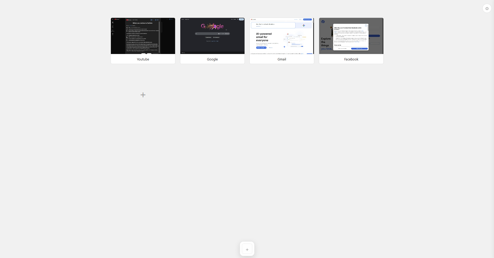

N# No-Frills-Start-Page

A clean, fast Chrome/Brave new-tab replacement with editable site tiles, live screenshot thumbnails, and a customizable dock — no bloat, no tracking.

## Features

- **Site tiles** with auto-generated live screenshot thumbnails (refresh on demand, or upload your own image instead)
- **Dock** of quick-launch icons, positionable on any edge of the screen
- **Light/dark theme**, with separate background colors per theme
- **Background images** — set any image, or enable Bing's daily "photo of the day" with optional auto-refresh, or search for images via the free Pexels API
- **Full layout control** — tile size, spacing, title padding, page padding, and tiles-per-row, all live-adjustable
- **Drag-and-drop reordering** for both tiles and dock items
- **Settings sync** across devices via your browser account, plus manual export/import for backups
- No analytics, no telemetry, no third-party scripts beyond the optional Bing/Pexels image lookups you opt into

## Installation

This extension isn't published on the Chrome Web Store — install it unpacked:

1. Download or clone this repository.
2. Open `chrome://extensions` (or `brave://extensions` in Brave).
3. Enable **Developer mode** (top-right toggle).
4. Click **Load unpacked** and select the project folder.
5. Open a new tab — it should now show this extension's start page.

To update later, pull the latest changes and click the reload icon for the extension on the extensions page.

## Options

All options live behind the gear icon (⚙) in the top-right corner.

| Section | Option | Description |
|---|---|---|
| Theme | Light / Dark | Switches the color scheme |
| Background color | Light mode / Dark mode | Solid background color used per theme when no image is set |
| Background image | Bing photo of the day | Sets today's Bing homepage image as the background |
| | Auto-refresh daily | Automatically pulls the new Bing image once a day |
| | Image search | Search and pick a background image via the Pexels API (requires a free API key) |
| | Clear | Removes the background image, falling back to the solid color |
| Layout | Spacing between tiles | Gap between tiles, in px |
| | Tile width / height | Size of each tile, in px |
| | Title text padding | Vertical padding around each tile's title text |
| | Page padding | Space between the tile grid and the edges of the page |
| | Tiles per row | Forces an exact column count, or "Auto" to fit as many as the available width allows |
| Dock position | Bottom / Top / Left / Right | Which edge of the screen the dock sits on |
| Thumbnails | Wait before taking screenshot | Delay before capturing a tile's thumbnail — increase for slow-loading sites (e.g. Disney+) so it doesn't capture a loading spinner |
| Backup | Export / Import | Manual JSON backup of tiles, dock items, and settings — useful for moving data outside of browser sync |
| — | Reset to defaults | Restores all settings to their defaults (tiles and dock items are unaffected) |

Click a tile's **✎** to edit its name/URL/thumbnail, or **⟳** to manually refresh its thumbnail. Middle-click a tile to open it in a background tab.

## How thumbnails work

Generating a thumbnail briefly opens the target site in a focused popup window, waits for it to load (plus the configured delay), takes a screenshot, then closes the window. This means:

- The popup will visibly flash and take focus for a few seconds while a thumbnail is being generated (most noticeable right after adding several tiles or importing a backup, since all of them need thumbnails at once).
- Thumbnails are cached locally per-device and are **not** included in export/import — after importing on a new machine, every tile regenerates its thumbnail once.

## Pexels API key (for image search)

Searching for background images uses the [Pexels API](https://www.pexels.com/api/), which requires a free API key:

1. Create a free account at [pexels.com](https://www.pexels.com/api/) and generate an API key from your account page.
2. In Settings → Background image, type a search query and hit Search — if no key is saved yet, you'll be prompted to paste one in.
3. Paste your key into the field and click **Save key**.

The key is stored locally (`chrome.storage.local`) on that device only — it is **not** synced across devices and is **not** included in export/import, so you'll need to re-enter it on each machine you use image search on. The Bing "photo of the day" feature doesn't need a key at all.

## Permissions

- `tabs` / `activeTab` / `host_permissions: <all_urls>` — needed to open and screenshot arbitrary tile URLs.
- `storage` — saves tiles, dock items, and settings (synced) plus cached thumbnails (local only).
- `alarms` — used for the once-a-day Bing photo check.

No data leaves your browser except direct, user-initiated requests to Bing (photo of the day) or Pexels (image search), and screenshot captures of the sites you've added as tiles.
